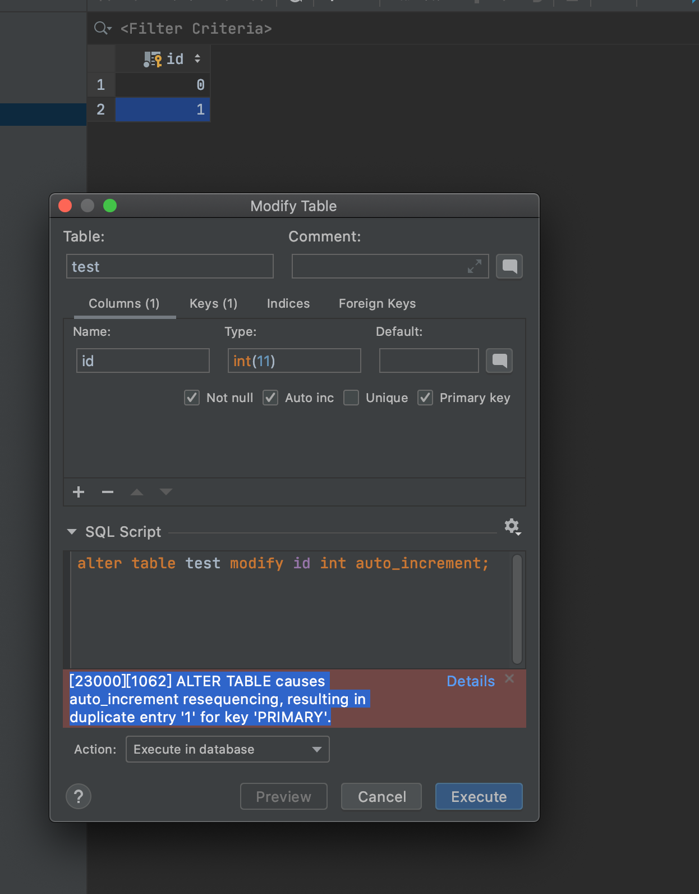
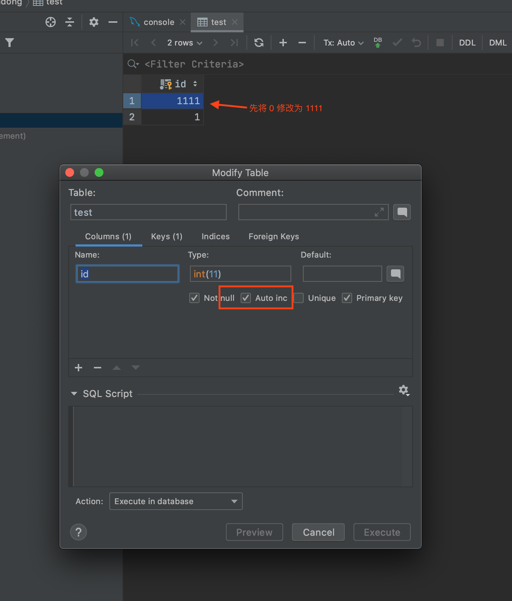
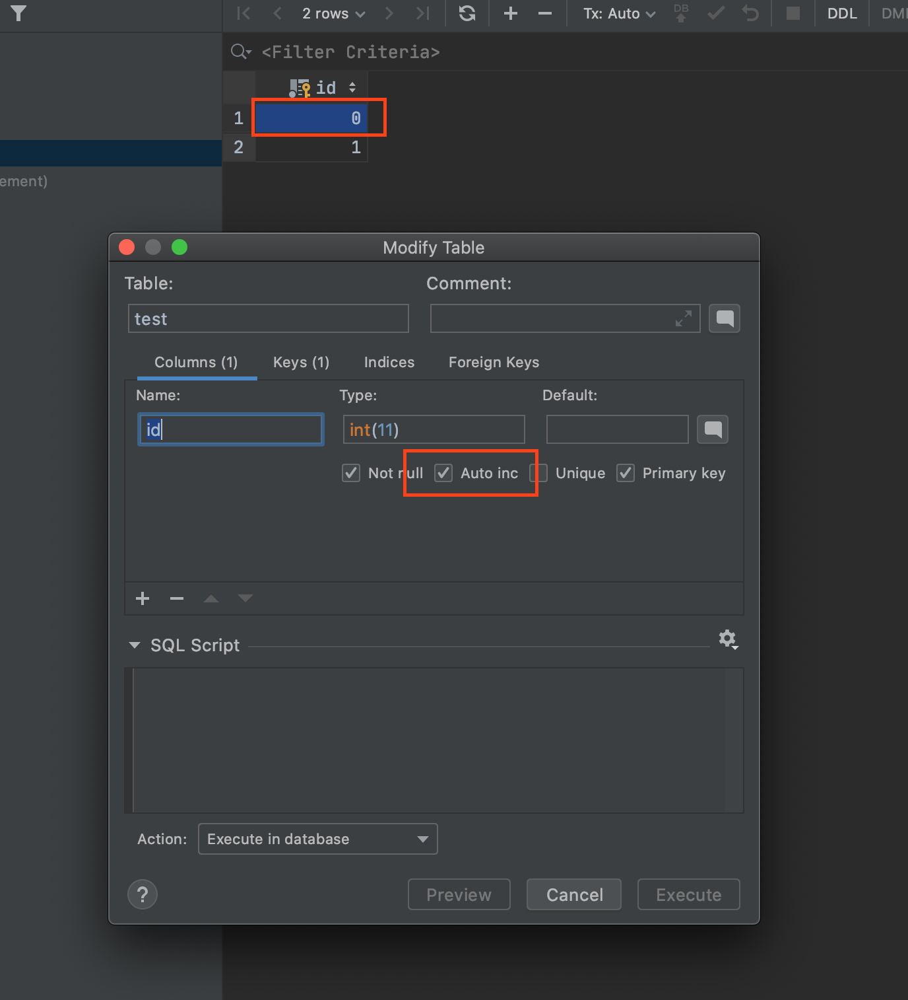

#### SQL 字段添加自增报错

> [23000][1062] ALTER TABLE causes auto_increment resequencing, resulting in duplicate entry '1' for key 'PRIMARY'.

通过报错信息可以看出来, 添加自增的字段的「最小值」必须大于等于 1。我们可以手动先将小于 1 的值修改为大于 1 。然后添加自增完成后在手动恢复原来值。

如: 

当我们添加自增就会报错。

可以先修改 ID 值在添加自增后，在修改回原来值就OK了。

[个人博客](isyundong.net)